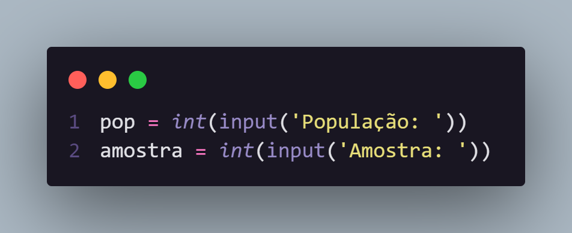
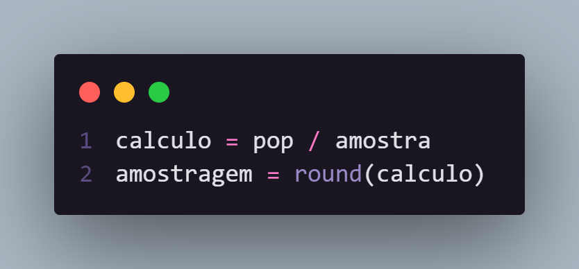
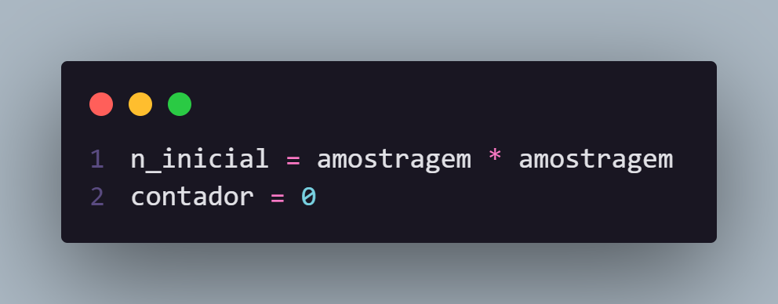
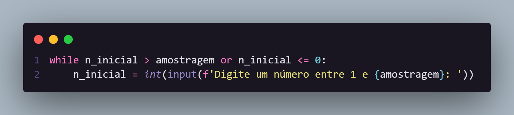
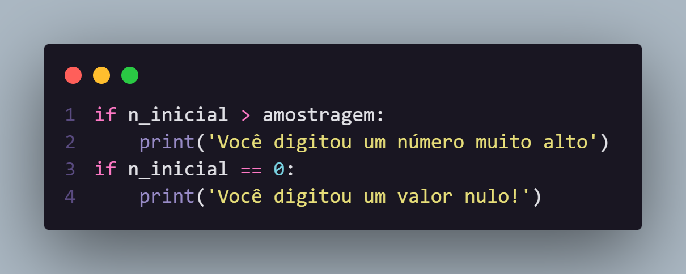
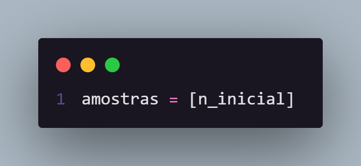
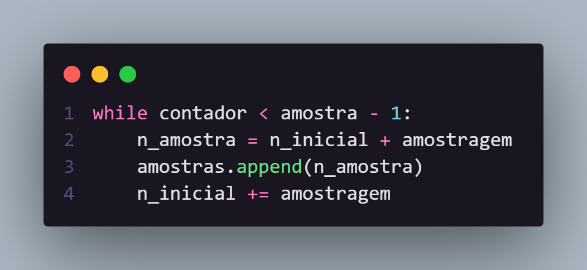
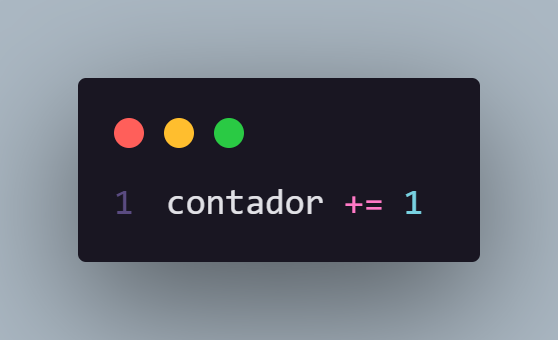
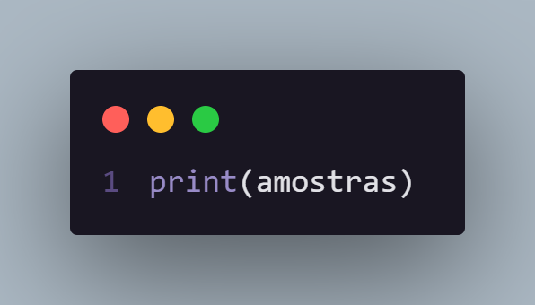

<h1>Amostragem sistematica em Python</h1>

  Programa em Python que, dada a população e a quantidade da amostra desejada,
  executa uma amostragem sistemática

  A amostra sistemática é utilizada quando os elementos da população a ser
  estudados já se encontram ordenados e, em seguida, são sorteados de acordo com
  uma certa periodicidade

<h2>Como o código funciona</h2>

<small>A explicação está em cima do código.</small>

  Vamos supor que uma operadora telefônica pretende saber a opinião de seus
  assinantes comerciais sobre seus serviços na cidade de Vargem Alegre. Supondo
  que há 25037 assinantes comerciais, e a amostra precisa ter no mínimo 800
  elementos. Mostre como seria organizada uma amostragem sistemática para
  selecionar os respondentes.

  Observe que a população já se encontra organizada, e precisamos apenas de 800
  amostras. Para isso deveriamos dividir a população pela quantidade de amostra
  desejada, o resultado desse calculo deverá ser o valor inicial da contagem. As
  amostras são sequenciais do número incial escolhido.

  São criados inputs para armazenar a população e a amostra em duas variaveis,

  

 

  É criado uma variável para armazenar o calculo, em seguida arredodamos esse
  calculo para ser a amostragem necessária para começamos a coletar as amostras

  

 

  Em seguida damos qualquer valor para o número inicial, para podemos criar o
  nosso loop (esse loop será utilizado para controlamos o fluxo de respostas do
  usuario). Também atribuimos o valor inicial da contagem, que deverá chegar até
  800 (no exemplo escolhido)

  

 

  Foi criado um loop para o usuario escolher um número de 1 até 31(que foi
  definido pelo calculo e arredodado). Enquando o número incial for maior que a
  amostragem <strong>ou</strong> for menor ou igual a zero, repita o processo.

  

 

  Também foi implementado dois fluxo de alertas, caso o usuario escolha um
  número muito alto, ou muito baixo

  

 

  Fora do loop, foi criado uma lista que recebera o número inicial escolhido
  pelo usuario.

  

 

  Depois passa para o loop que coletará as amostras, ele continuará repitindo
  até que a contagem for menor que a amostra (escolhida pelo usuario, que como
  exemplo, seria 800), em seguida criamos uma variavel que receberá a amostragem
  da vez +(mais) o número inicial. Essa amostra será jogada na lista de
  amostras.

  

  Não podemos esquecer de ir aumentando a contagem no final do processo, para
  evitar um loop infinito

  

  No fim, fora do loop, apenas exibimos a lista com todas as amostras escolhido
  pelo algoritmo seguindo o conceito de amostra sistematica.

  

OBS: Quando eu tiver tempo vou atualizar o README para o código refatorado

